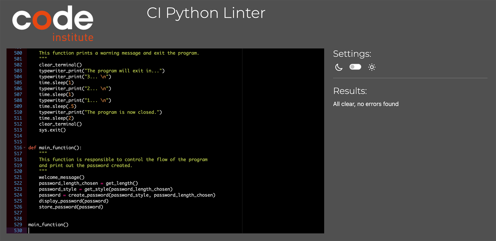
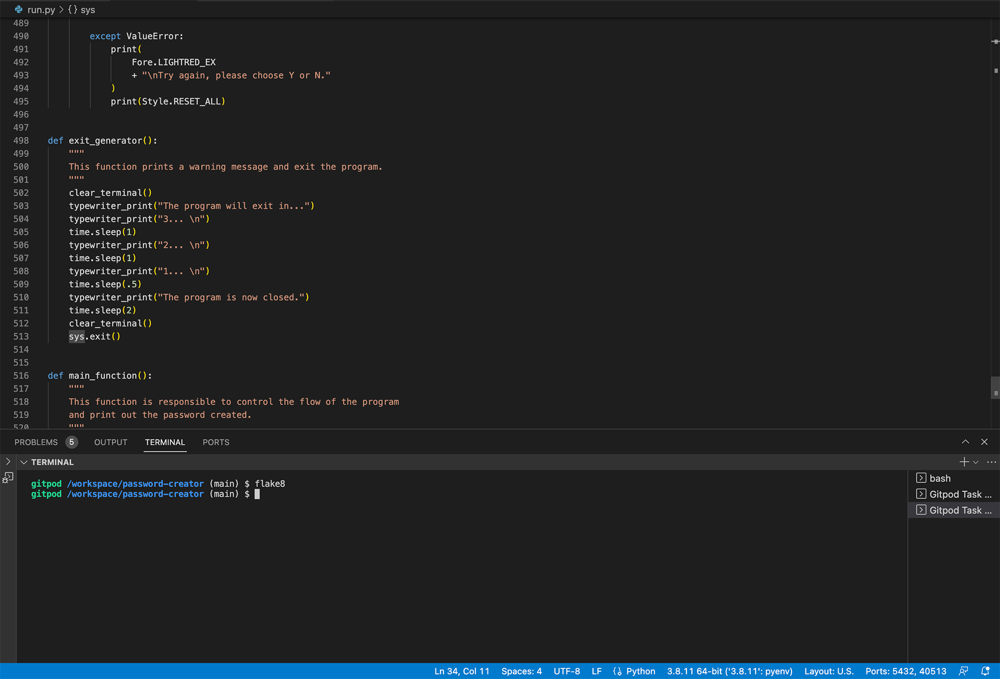

# Password Creator
(Developer: Valentino Braga)

Password Creator is a program that generates a unique and random password for the user based on their desired specifications. The user is prompted to select a password length and choose from three different styles: letter only, numbers only, or mixed (letters, numbers, and symbols). Once the user has selected their preferred options, the program generates a random password and if the user wishes, they can save the generated password along with a corresponding URL and username in a Google spreadsheet. This program provides a convenient and secure way for users to generate strong passwords and save them in a centralized location for easy access.

[Live Website](https://password-creatorr.herokuapp.com/)

# Table of Contents

# User Experience (UX)

## Business Goals

### User Goals
- Find an interactive way to run the program.
- Clear rules and easy access to it.
- Possibility to exit the app.
- Possibility to create unique and random passwords.
- Possibility to store their login information.

### Website Owner Goals
- Deliver easy-to-read rules to attract users.
- Provide a range of possibilities to style passwords.
- To provide a database where the users can store their information.

### Target Audience
- Organizations of all sizes that require secure access to their systems and networks. 
- Anyone who's looking to create safe passwords.
- Anyone who's looking to create and store login information.

### User Expectations
- Smooth experience.
- Intuitive interface.
- Appealing design.

## User Stories

### First-Time User
1. As a first-time user, I want to understand how the program works.
2. As a first-time user, I want to create a unique password.
3. As a first-time user, I want to have style options when creating the password.
4. As a first-time user, I want to exit the program at any given time.

### Returning User
1. As a returning user, I want to be able to save my password.
2. As a returning user, I want to have the possibility of creating different passwords.
3. As a returning user, I want to save my password with my login information.
4. As a returning user, I want to save my password with my login information.

### Site Owner
1. As a site owner, I want users to easily understand my software.
2. As a site owner, I want users to create different passwords.
3. As a site owner, I want users to feel safe.
4. As a site owner, I want users to be able to store their login information.
5. As a site owner, I want users to be able to exit whenever they want to.

# Flowchart

Brief description.

Start Interface Wireframe

 

# Features

Brief description.

### Feature Name
- 
- 
- 

 

# Future Features

1. Add the ability to generate multiple passwords at once.
2. Allow users to choose specific symbols or special characters to include in their passwords.
3. Add a feature to check if the password is strong enough, based on common password criteria such as length, complexity, and uniqueness.
4. Implement a secure random number generator, such as the "secrets" module, for generating passwords.
5. Consider adding an option for the user to enter their own passphrase, which the program can convert into a password using a hashing algorithm.

# Technologies Used

### Language
The following language were used to develop the website:
- Python
- HTML
- CSS

### Tools and Resources
The following tools and resources were used to develop the website:
- Git
- Github
- Gitpod
- Google
- Heroku
- Favicon
- Lucidchart
- Codecademy
- W3 Schools
- Stack Overflow
- Github Projects
- CI Python Linter
- Techsini Mockup Generator
- GitHub Wiki TOC generator

# Testing Cases

# Python Validation

### CI Python Linter

The project was validated using the provided CI Python Linter and it was cleared with no errors.

CI Python Linter Validation

 

### Flake8

Flake8 is a Python library that wraps PyFlakes, pycodestyle and Ned Batchelder’s McCabe script. It is a great toolkit for checking your code base against coding style (PEP8), programming errors (like “library imported but unused” and “Undefined name”) and to check cyclomatic complexity. The program passed without any errors. 

Flake8 Python Validation

 

# Bugs

Bug:
Fix:

Bug:
Fix:

Bug:
Fix:

# Deployment

[Click Here To See The Live Website](https://password-creatorr.herokuapp.com/)

### Deploy
The website was deployed through the use of GitHub Pages, a feature built in to GitHub. This can be done by following the steps below.
1. In the desired repository, click on "Settings" from the top menu.
2. From the side menu to your left, select "Pages" in the "Code and automation" section.
3. Make sure the "Source" option is set to "Deploy from a branch"
4. Select the desired "Branch" from the drop down below (main branch in most cases, making sure the director is set to /(root)).
5. Select "Save", and after it refreshes the page, you will see a box at the top of the page providing you with the URL of your now published site.

To contribute or check the code yourself, you can fork or clone the repository as well.

### Fork
1. Go to the desired repository
2. Click "Fork" in the upper right corner
3. Select the owner, and set the repository name. A description can be added if desired
4. Choose whether to copy the default branch, or all branches
5. Click "Create Form"

### Clone

1. Go to the desired repository
2. Click the "Code" button at the top of the files section of the page
3. Select your desired method for cloning (HTTPS/SSH/GitHub CLI)
4. Open Git Bash
5. Change the current working directory to the location where you want the cloned directory
6. Type "git clone", and then paste the URL you copied earlier. It will look like this, with your GitHub username instead of "YOUR-USERNAME": "$ git clone https://github.com/YOUR-USERNAME/DESIRED-REPOSITORY"
7. Press Enter. Your local clone will be created.

### Heroku

1. Create a user account with Heroku.
2. Click New in the top-right corner of your Heroku Dashboard.
3. Click on the dropdown menu and select create new.
4. The app name is unique to all apps within Heroku so select one that is not currently in use.
5. Select a region, EU or USA.
6. Click Create App.
7. In the app settings click Reveal Config vars, set the value of KEY to PORT, and the value to 8000 and click add.
8. Click Add Buildpack.
9. Choose Python first and click add.
10. Choose Node.js second.
11. The order is important, Python needs to be first, then Node.js second.
12. Click on the Deploy tab, select connect to Github and search for your repository.
13. Click on Enable automatic deploy or Deploy branch depending on your use case.

# Credits

### A list of references and tutorials used for the project:

* [Password Generator Tutorial 1](https://www.geeksforgeeks.org/create-a-random-password-generator-using-python/)
* [How to Create Random Strings](https://favtutor.com/blogs/create-random-string-password-python)
* [Checking User's Input](https://pynative.com/python-check-user-input-is-number-or-string/#:~:text=Use%20string%20isdigit()%20method,number%2C%20it%20will%20not%20work.)
* [Typing Effect](https://stackoverflow.com/questions/20302331/typing-effect-in-python)
* [How to Clear Terminal](https://www.codingninjas.com/codestudio/library/how-to-clear-a-screen-in-python)
* [How to Use "if not" Statements](https://stackoverflow.com/questions/10406130/check-if-something-is-not-in-a-list-in-python)
* GitHub Repositories.
* Love Sandwiches Project.

### Imported Modules

* [time](https://docs.python.org/3/library/time.html)
* [os](https://docs.python.org/3/library/os.html?highlight=os#module-os)
* [sys](https://docs.python.org/3/library/sys.html?highlight=sys#module-sys)
* [random](https://docs.python.org/3/library/random.html)
* [string](https://docs.python.org/3/library/string.html?highlight=string#module-string)
* [google-auth](https://google-auth.readthedocs.io/en/master/)
* [colorama](https://pypi.org/project/colorama/)
* [pyfiglet](https://pypi.org/project/pyfiglet/0.7/)
* [gspread](https://docs.gspread.org/en/v5.7.1/)
* [flake8](https://flake8.pycqa.org/en/latest/)

# Acknowledgements

I would like to take this opportunity to acknowledge and thank the following people:

- Bethany and Kim from Code Institute Studen Care for looking out for me.
- Brian O'Hare my mentor for all the help and guidance.
- My sister who's always encouraging me.
- My husband who's there when I need him and is always pushing me forward.