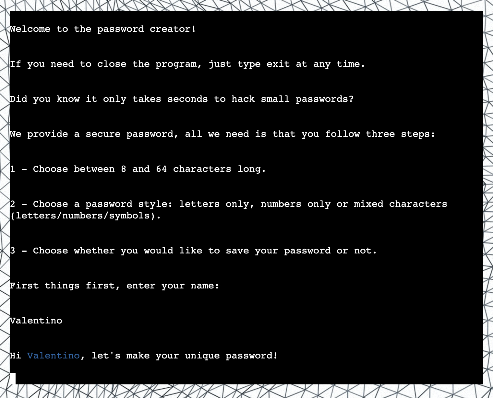
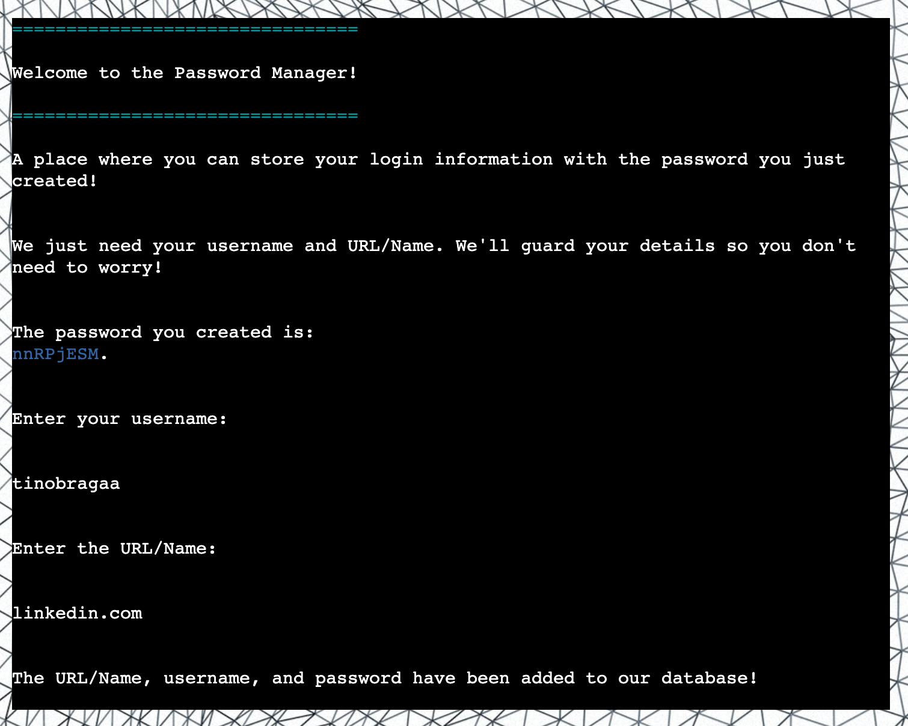
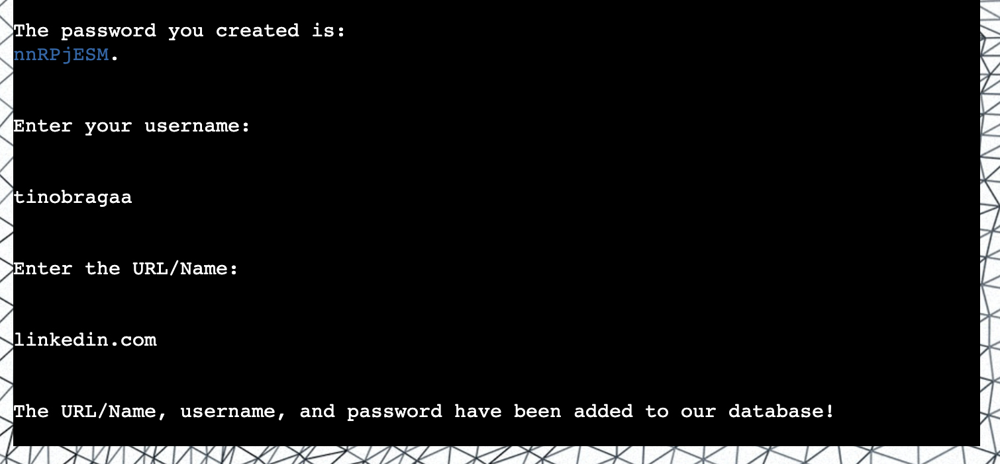

# Password Creator
(Developer: Valentino Braga)

Password Creator is a program that generates a unique and random password for the user based on their desired specifications. The user is prompted to select a password length and choose from three different styles: letter only, numbers only, or mixed (letters, numbers, and symbols). Once the user has selected their preferred options, the program generates a random password and if the user wishes, they can save the generated password along with a corresponding URL and username in a Google spreadsheet. This program provides a convenient and secure way for users to generate strong passwords and save them in a centralized location for easy access.

[Live Website](https://password-creatorr.herokuapp.com/)
 
[Google Sheet](https://docs.google.com/spreadsheets/d/131mYKUrBYmHf_NzeRnV3dqDWoZ_dvIrwJPw3xEucOAg/edit?usp=sharing)

# Table of Contents
- [Password Creator](#password-creator)
- [Table of Contents](#table-of-contents)
- [User Experience (UX)](#user-experience--ux-)
  * [Business Goals](#business-goals)
    + [User Goals](#user-goals)
    + [Website Owner Goals](#website-owner-goals)
    + [Target Audience](#target-audience)
    + [User Expectations](#user-expectations)
  * [User Stories](#user-stories)
    + [First-Time User](#first-time-user)
    + [Returning User](#returning-user)
    + [Site Owner](#site-owner)
- [Flowchart](#flowchart)
- [Features](#features)
    + [Start Interface](#start-interface)
    + [Get Length/Style Interface](#get-length-style-interface)
    + [Display Password Interface](#display-password-interface)
    + [Password Manager Interface](#password-manager-interface)
    + [Exit Interface](#exit-interface)
    + [Google Sheet](#google-sheet)
- [Future Features](#future-features)
- [Technologies Used](#technologies-used)
    + [Language](#language)
    + [Tools and Resources](#tools-and-resources)
- [Testing Cases](#testing-cases)
    + [User Stories](#user-stories-1)
    + [Validation](#validation)
- [HTML Validation](#html-validation)
- [CSS Validation](#css-validation)
- [Python Validation](#python-validation)
    + [CI Python Linter](#ci-python-linter)
    + [Flake8](#flake8)
- [Bugs](#bugs)
- [Deployment](#deployment)
    + [Deploy](#deploy)
    + [Fork](#fork)
    + [Clone](#clone)
    + [Heroku](#heroku)
- [Credits](#credits)
    + [A list of references and tutorials used for the project:](#a-list-of-references-and-tutorials-used-for-the-project-)
    + [Imported Modules](#imported-modules)
- [Acknowledgements](#acknowledgements)

# User Experience (UX)

## Business Goals

### User Goals
- Find an interactive way to run the program.
- Clear rules and easy access to it.
- Possibility to exit the app.
- Possibility to create unique and random passwords.
- Possibility to store their login information.

### Website Owner Goals
- Deliver easy-to-read rules to attract users.
- Provide a range of possibilities to style passwords.
- To provide a database where the users can store their information.

### Target Audience
- Organizations of all sizes that require secure access to their systems and networks. 
- Anyone who's looking to create safe passwords.
- Anyone who's looking to create and store login information.

### User Expectations
- Smooth experience.
- Intuitive interface.
- Appealing design.

## User Stories

### First-Time User
1. As a first-time user, I want to understand how the program works.
2. As a first-time user, I want to create a unique password.
3. As a first-time user, I want to have style options when creating the password.
4. As a first-time user, I want to exit the program at any given time.

### Returning User
1. As a returning user, I want to be able to save my password.
2. As a returning user, I want to have the possibility of creating different passwords.
3. As a returning user, I want to exit the program at any given time.
4. As a returning user, I want to have a secure password.

### Site Owner
1. As a site owner, I want users to easily understand my software.
2. As a site owner, I want users to create different passwords.
3. As a site owner, I want users to feel safe.
4. As a site owner, I want users to be able to store their login information.
5. As a site owner, I want users to be able to exit whenever they want to.

# Flowchart

I designed the following flowchart using Lucid charts to grasp the necessary steps involved in developing the program.

Start Interface Wireframe

 

# Features

### Start Interface
- Appealing design, abstract patterns in the background image to reference a database;
- Centralized terminal and button for a better experience;
- Social media links icons (GitHub/LinkedIn);
- Button hover effect;
- Icons hover effect;
- Program presentation/logo, how-it-works text, user input, input validation and input confirmation.

Start Interface

 

Logo Presentation

 

How It Works Text

 

Name's Input Validation

 

User Name's Input Confirmation

 

Button Hover Effect

 

Links Hover Effect

 

### Get Length/Style Interface
- Prompt the user for the password length: a number between 8-64;
- Prompt the user for the password style: letters only, numbers only or mixed characters (letters/numbers/symbols);
- Confirmation text for every input;
- Different answers for every chosen style;
- Input validation.

Length/Style Interface

 

Length's Input Confirmation

 

Length's Input Validation

 

Letters Only Confirmation

 

Numbers Only Confirmation

 

Mixed Characters Confirmation

 

Style's Input Validation

 

### Display Password Interface
- Tech jokes for good user experience;
- The password displayed in a different color for positive feelings;
- Prompt the user if they want to save;
- Prompt the user if they want to restart or exit;
- Input validation.

Display Password Interface

 

Password Highlighted

 

Save Input Validation

 

Restart/Exit Input Validation

 

### Password Manager Interface
- An interface where the user can save login information into google spreadsheet;
- Small presentation and how it works;
- Password reminder highlighted;
- Prompt user for username;
- Prompt user for URL;
- Saved login information to the database confirmation;
- Prompt the user if wants to start again or exit.

Password Manager Interface

 

Login Saved Confirmation

 

Password Reminder

 

Username/URL Input Validation

 

Restart/Exit Input Validation

 

### Exit Interface
- At every input, the user can type "exit" which leads to this interface;
- There's a timer for good user experience;
- Once the timer is finished, it clears the terminal.

Exit Instruction

 

Exit Interface

 

Program Closed

 

### Google Sheet
- Every password save is loaded to the google spread sheet.

[Check Google Sheet Link](https://docs.google.com/spreadsheets/d/131mYKUrBYmHf_NzeRnV3dqDWoZ_dvIrwJPw3xEucOAg/edit?usp=sharing)

Google Sheet

 

# Future Features

1. Add the ability to generate multiple passwords at once.
2. Allow users to choose specific symbols or special characters to include in their passwords.
3. Add a feature to check if the password is strong enough, based on common password criteria such as length, complexity, and uniqueness.
4. Implement a secure random number generator, such as the "secrets" module, for generating passwords.
5. Consider adding an option for the user to enter their own passphrase, which the program can convert into a password using a hashing algorithm.

# Technologies Used

### Language
The following language were used to develop the website:
- Python
- HTML
- CSS

### Tools and Resources
The following tools and resources were used to develop the website:
- Git
- Github
- Gitpod
- Google
- Heroku
- Favicon
- Lucidchart
- Codecademy
- W3 Schools
- Stack Overflow
- Github Projects
- CI Python Linter
- Techsini Mockup Generator
- GitHub Wiki TOC generator

# Testing Cases

### User Stories

| **User Story**                                                                       | **Feature**                                                                                                               | **Achieved** |
|--------------------------------------------------------------------------------------|---------------------------------------------------------------------------------------------------------------------------|--------------|
| As a first-time user, I want to understand how the program works.                    | Explanations throughout the program.                                                                                      | Yes.         |
| As a first-time user, I want to create a unique password.                            | Passwords are created randomly.                                                                                           | Yes.         |
| As a first-time user, I want to have style options when creating the password.       | Passwords can have three styles.                                                                                          | Yes.         |
| As a first-time user, I want to exit the program at any given time.                  | Possibility to exit at any given time when typing "exit".                                                                 | Yes.         |
| As a returning user, I want to be able to save my password.                          | Possibility to save the password in the Google Sheet.                                                                     | Yes.         |
| As a returning user, I want to have the possibility of creating different passwords. | Passwords are created randomly and can have three styles.                                                                 | Yes.         |
| As a returning user, I want to exit the program at any given time.                   | Possibility to exit at any given time when typing "exit".                                                                 | Yes.         |
| As a returning user, I want to have a secure password.                               | Passwords are created randomly starting at 8 characters. Also, there is small bits of information throughout the program. | Yes.         |
| As a site owner, I want users to easily understand my software.                      | Explanations throughout the program.                                                                                      | Yes.         |
| As a site owner, I want users to create different passwords.                         | Passwords are created randomly and can have three styles.                                                                 | Yes.         |
| As a site owner, I want users to feel safe.                                          | Passwords are created randomly starting at 8 characters. Also, there is small bits of information throughout the program. | Yes.         |
| As a site owner, I want users to be able to store their login information.           | Possibility to save the login information with the password created in the Google Sheet.                                  | Yes.         |
| As a site owner, I want users to be able to exit whenever they want to.              | Possibility to exit at any given time when typing "exit".                                                                 | Yes.         |

### Validation

| **Feature**                | **Expectation**                                                                              | **Action**                                                                              | **Result**                                                                                   |
|----------------------------|----------------------------------------------------------------------------------------------|-----------------------------------------------------------------------------------------|----------------------------------------------------------------------------------------------|
| **Enter your name:**       |                                                                                              |                                                                                         |                                                                                              |
| Invalid.                   | Invalid answer message is displayed and user prompter to enter valid answer.                 | Empty string.                                                                           | Invalid answer message is displayed and user prompter to enter valid answer.                 |
| Invalid.                   | Invalid answer message is displayed and user prompter to enter valid answer.                 | Numbers.                                                                                | Invalid answer message is displayed and user prompter to enter valid answer.                 |
| Invalid.                   | Invalid answer message is displayed and user prompter to enter valid answer.                 | input < 3 characters                                                                    | Invalid answer message is displayed and user prompter to enter valid answer.                 |
| Invalid.                   | Invalid answer message is displayed and user prompter to enter valid answer.                 | input > 16 characters                                                                   | Invalid answer message is displayed and user prompter to enter valid answer.                 |
| Valid.                     | Loads the choose length/style interface.                                                     | Input filled with a word without numbers, longer than 3 and shorter than 16 characters. | Loads the choose length/style interface.                                                     |
| **Enter password length:** |                                                                                              |                                                                                         |                                                                                              |
| Invalid.                   | Invalid answer message is displayed and user prompter to enter valid answer.                 | input < 8 or input > 64                                                                 | Invalid answer message is displayed and user prompter to enter valid answer.                 |
| Valid.                     | Prompts the next question: choose a style.                                                   | input >= 8 and input <= 64                                                              | Prompts the next question: choose a style.                                                   |
| **Choose password style:** |                                                                                              |                                                                                         |                                                                                              |
| Invalid.                   | Invalid answer message is displayed and user prompter to enter valid answer.                 | input != 1, 2 or 3                                                                      | Invalid answer message is displayed and user prompter to enter valid answer.                 |
| Valid.                     | Loads the display password interface.                                                        | input = 1, 2 or 3                                                                       | Loads the display password interface.                                                        |
| **Save password?**         |                                                                                              |                                                                                         |                                                                                              |
| Invalid.                   | Invalid answer message is displayed and user prompter to enter valid answer.                 | input != "y", "Y", "n" or "N"                                                           | Invalid answer message is displayed and user prompter to enter valid answer.                 |
| Valid.                     | If "y" or "Y" prompts store password interface, if "n" or "N" prompts restart/exit question. | input = "y", "Y", "n" or "N"                                                            | If "y" or "Y" prompts store password interface, if "n" or "N" prompts restart/exit question. |
| **Enter username:**        |                                                                                              |                                                                                         |                                                                                              |
| Invalid.                   | Invalid answer message is displayed and user prompter to enter valid answer.                 | Empty input.                                                                            | Invalid answer message is displayed and user prompter to enter valid answer.                 |
| Invalid.                   | Invalid answer message is displayed and user prompter to enter valid answer.                 | input < 3                                                                               | Invalid answer message is displayed and user prompter to enter valid answer.                 |
| Valid.                     | Prompts next question: enter URL?                                                            | A filled input with more than 3 characters.                                             | Prompts next question: enter URL?                                                            |
| **Enter URL/Name:**        |                                                                                              |                                                                                         |                                                                                              |
| Invalid.                   | Invalid answer message is displayed and user prompter to enter valid answer.                 | Empty input.                                                                            | Invalid answer message is displayed and user prompter to enter valid answer.                 |
| Invalid.                   | Invalid answer message is displayed and user prompter to enter valid answer.                 | input < 3                                                                               | Invalid answer message is displayed and user prompter to enter valid answer.                 |
| Valid.                     | Prompts next question: restart?                                                              | A filled input with more than 3 characters.                                             | Prompts next question: restart?                                                              |
| **Restart?:**              |                                                                                              |                                                                                         |                                                                                              |
| Invalid.                   | Invalid answer message is displayed and user prompter to enter valid answer.                 | input != "y", "Y", "n" or "N"                                                           | Invalid answer message is displayed and user prompter to enter valid answer.                 |
| Valid.                     | If "y" or "Y" reloads the program, if "n" or "N" exit program.                               | input = "y", "Y", "n" or "N"                                                            | If "y" or "Y" reloads the program, if "n" or "N" exit program.                               |

Name's Input Validation

 

Length's Input Validation

 

Style's Input Validation

 

Save Input Validation

 

Username/URL Input Validation

 

Restart/Exit Input Validation

 

# HTML Validation

The Nu HTML Checker (W3C) is used to validate HTML documents. The files passed without any errors.

index.html Validation

 

layout.html Validation

 

# CSS Validation

The W3C Jigsaw CSS Validation Service is used to validate CSS documents. The file passed without any errors.

CSS Validation

 

# Python Validation

### CI Python Linter

The project was validated using the provided CI Python Linter and it was cleared with no errors.

CI Python Linter Validation

 

### Flake8

Flake8 is a Python library that wraps PyFlakes, pycodestyle and Ned Batchelder’s McCabe script. It is a great toolkit for checking your code base against coding style (PEP8), programming errors (like “library imported but unused” and “Undefined name”) and to check cyclomatic complexity. The program passed without any errors. 

Flake8 Python Validation

 

# Bugs

There were many small bugs throughout the process, however, I was able to manage searching online and with my colleague's help. Here are a few that stumped me enough to write them down:

Bug: When I was testing the program, the store_password() was being called two times in a row. I was calling the store_password() from an if statement inside the display_password() and from inside the main() function.
 
Fix: I removed the call from within the display_password(.)

Bug: When I was trying to run the display_password() function I was getting a TypeError. I was using a variable called "store_password" and at the same time, I had a function called store_password().
 
Fix: I changed the variable name.

Bug: When I was trying to style the terminal interface with CSS and add a few HTML elements I couldn't, the built-in preview couldn't show the same as it was in the deployed version of the project in the Heroku platform. 
 
Fix: After a search in the Slack channel I've learned that to open the project in the browser I needed to be able to run the index.js file from the terminal. To achieve I had to install "npm install" to install the node package manager and then "node index.js" to run it.

# Deployment

[Click Here To See The Live Website](https://password-creatorr.herokuapp.com/)

### Deploy
The website was deployed through the use of GitHub Pages, a feature built in to GitHub. This can be done by following the steps below.
1. In the desired repository, click on "Settings" from the top menu.
2. From the side menu to your left, select "Pages" in the "Code and automation" section.
3. Make sure the "Source" option is set to "Deploy from a branch"
4. Select the desired "Branch" from the drop down below (main branch in most cases, making sure the director is set to /(root)).
5. Select "Save", and after it refreshes the page, you will see a box at the top of the page providing you with the URL of your now published site.

To contribute or check the code yourself, you can fork or clone the repository as well.

### Fork
1. Go to the desired repository
2. Click "Fork" in the upper right corner
3. Select the owner, and set the repository name. A description can be added if desired
4. Choose whether to copy the default branch, or all branches
5. Click "Create Form"

### Clone

1. Go to the desired repository
2. Click the "Code" button at the top of the files section of the page
3. Select your desired method for cloning (HTTPS/SSH/GitHub CLI)
4. Open Git Bash
5. Change the current working directory to the location where you want the cloned directory
6. Type "git clone", and then paste the URL you copied earlier. It will look like this, with your GitHub username instead of "YOUR-USERNAME": "$ git clone https://github.com/YOUR-USERNAME/DESIRED-REPOSITORY"
7. Press Enter. Your local clone will be created.

### Heroku

1. Create a user account with Heroku.
2. Click New in the top-right corner of your Heroku Dashboard.
3. Click on the dropdown menu and select create new.
4. The app name is unique to all apps within Heroku so select one that is not currently in use.
5. Select a region, EU or USA.
6. Click Create App.
7. In the app settings click Reveal Config vars, set the value of KEY to PORT, and the value to 8000 and click add.
8. Click Add Buildpack.
9. Choose Python first and click add.
10. Choose Node.js second.
11. The order is important, Python needs to be first, then Node.js second.
12. Click on the Deploy tab, select connect to Github and search for your repository.
13. Click on Enable automatic deploy or Deploy branch depending on your use case.

# Credits

### A list of references and tutorials used for the project:

* [Password Generator Tutorial 1](https://www.geeksforgeeks.org/create-a-random-password-generator-using-python/)
* [How to Create Random Strings](https://favtutor.com/blogs/create-random-string-password-python)
* [Checking User's Input](https://pynative.com/python-check-user-input-is-number-or-string/#:~:text=Use%20string%20isdigit()%20method,number%2C%20it%20will%20not%20work.)
* [Typing Effect](https://stackoverflow.com/questions/20302331/typing-effect-in-python)
* [How to Clear Terminal](https://www.codingninjas.com/codestudio/library/how-to-clear-a-screen-in-python)
* [How to Use "if not" Statements](https://stackoverflow.com/questions/10406130/check-if-something-is-not-in-a-list-in-python)
* GitHub Repositories.
* Love Sandwiches Project.

### Imported Modules

* [time](https://docs.python.org/3/library/time.html)
* [os](https://docs.python.org/3/library/os.html?highlight=os#module-os)
* [sys](https://docs.python.org/3/library/sys.html?highlight=sys#module-sys)
* [random](https://docs.python.org/3/library/random.html)
* [string](https://docs.python.org/3/library/string.html?highlight=string#module-string)
* [google-auth](https://google-auth.readthedocs.io/en/master/)
* [colorama](https://pypi.org/project/colorama/)
* [pyfiglet](https://pypi.org/project/pyfiglet/0.7/)
* [gspread](https://docs.gspread.org/en/v5.7.1/)
* [flake8](https://flake8.pycqa.org/en/latest/)

# Acknowledgements

I would like to take this opportunity to acknowledge and thank the following people:

- Bethany and Kim from Code Institute Studen Care for looking out for me.
- Brian O'Hare my mentor for all the help and guidance.
- My sister who's always encouraging me.
- My husband who's there when I need him and is always pushing me forward.